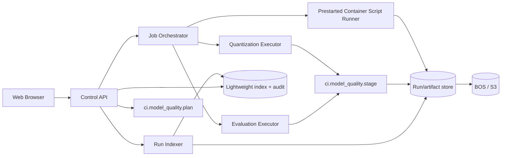
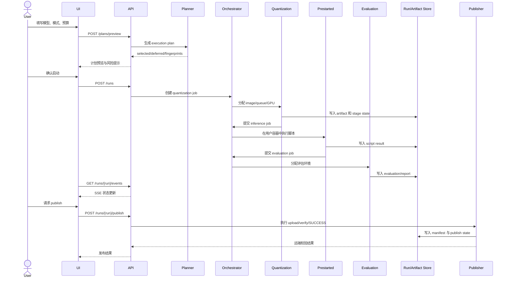
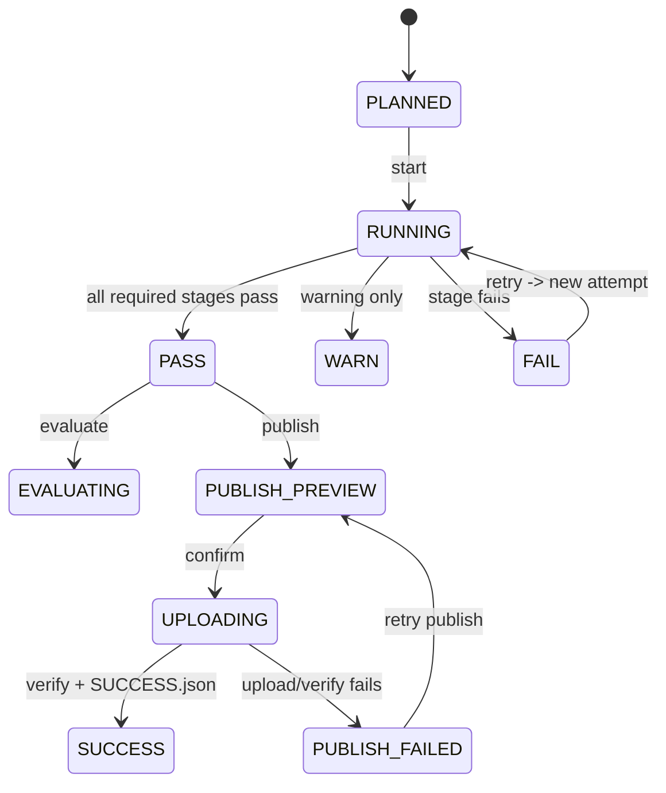
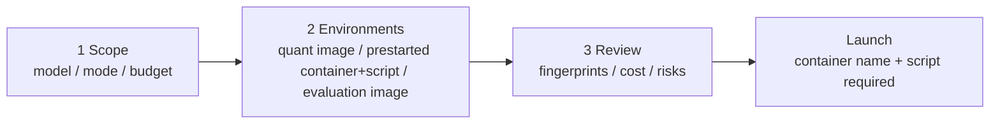

# Model Quality CI Web 设计方案

## 1. 目标与设计原则

当前 `ci/model_quality` 已具备配置校验、计划生成、GPU-hour admission、Buildkite 动态流水线、分阶段状态、artifact/evaluation fingerprint、评测、报告和 BCE publish。Web 界面应作为控制面和只读审计面，复用现有 CLI 与 JSON 产物，不把量化逻辑复制到 Web 服务中。本文同时区分当前单机/Buildkite 实现和目标多环境调度架构；目标架构的 API 不应假定现有 `stage.py` 已经具备跨主机调度能力。

设计目标：

- 让用户能在一分钟内回答“这次运行是否通过、卡在哪一步、产物是否已发布”。
- 让每个状态都能追溯到 run、attempt、model、stage、fingerprint 和日志。
- 把高成本动作（quantize、evaluate、publish）做成明确的受控操作。
- 默认安全：计划先预览，发布前显示 allowlist、远端前缀和校验结果。
- 支持单机共享目录起步，但生产部署必须使用跨服务器可访问的持久化存储；SQL 只作为可选查询索引。

## 2. 当前 CI 流程审查

### 2.1 已有流程

`plan` 根据模型优先级和 GPU-hour 预算生成 `execution-plan.json`，为每个选中模型计算 artifact fingerprint 和 evaluation fingerprint，并标记 `DEFERRED_BUDGET`。

Buildkite 按 run mode 生成依赖链：

- `quantize`：preflight → quantize → validate → runtime-smoke → report
- `quantize_and_eval`：上述流程追加 evaluate
- `eval_only`：preflight → validate → runtime-smoke → evaluate → report
- `upload_only`：preflight → validate → runtime-smoke → report → publish

模型启用上传时，普通 quantize/eval pipeline 会自动加入 publish。每个 stage 写入 attempt-local state，同时更新 shared latest state；报告在 attempt 目录生成后原子提升到 shared reports 视图。preflight 成功后，`input-manifest.json` 固化源 checkpoint provenance 和 finalized artifact fingerprint。publish 生成 SHA256 upload manifest，远端校验成功后最后上传 `SUCCESS.json`。

### 2.2 Web 设计必须尊重的身份关系

| 身份 | 用途 | UI 展示 |
|---|---|---|
| run_id | 一次计划/流水线运行 | Run 页面主标题 |
| attempt_id | 同一 run 的一次尝试 | Attempts 标签、日志筛选 |
| artifact fingerprint | 量化产物身份 | Artifact 卡片、stale 检查 |
| evaluation fingerprint | 评测配置与产物身份 | Evaluation 卡片 |
| artifact content fingerprint | 实际文件内容身份 | Publish/manifest 详情 |
| git_sha / workflow.revision | 代码与量化入口版本 | Reproducibility 区域 |

不能把“当前配置重新计算出的 fingerprint”覆盖旧 run 的冻结身份。Web 端应将配置变更显示为新计划或新 run。

## 3. 总体架构

### 3.1 分层

1. **Web UI**：运行列表、计划向导、流水线详情、模型详情、报告和发布确认。
2. **Control API**：读取计划/state/report/manifest，创建 plan，提交运行请求，执行受控 retry/eval/publish。
3. **Executor adapter**：第一阶段调用现有 `ci.model_quality.plan`、Buildkite API/CLI 和 stage CLI；后续接入容器/Kubernetes/其他调度器，不重新实现量化。
4. **Indexer**：监听共享 `MODEL_QUALITY_RUNS_ROOT` 或对象存储，解析 JSON 状态、日志索引和报告。
5. **调度与执行**：由 Job Orchestrator 根据能力标签和队列动态分配量化、评估 job，并把推理脚本提交到用户已启动的容器。
6. **存储**：对象存储或跨服务器共享持久卷保存事实数据；SQLite/PostgreSQL 都是可选的查询索引和审计存储，不保存 checkpoint、artifact 或完整日志。
7. **认证与策略**：OIDC/SSO、项目/模型权限、publish 权限、操作审计。



当前实现可以把 Orchestrator 和 Executor adapter 合并在 Buildkite adapter 中，以现有 queue 和动态 pipeline 执行；推理脚本执行器只负责验证容器名、解析脚本 argv、执行并记录结果。跨服务器版本再拆出独立调度服务。无论采用哪种执行器，Run Store 的状态和 job 事件格式必须保持一致。

SQL 不是 CI 数据链路的必需组件。没有 SQL 时，Web 可以扫描对象存储中的 run manifest、state 和 report metadata 构建列表；SQL 的价值是加速筛选、分页、权限查询和审计检索。单实例、低并发可以使用 SQLite，但 SQLite 文件必须放在持久化卷上，不能放在 Web 服务器的临时磁盘；多实例或多个 executor 并发写入时使用托管 PostgreSQL，仍只保存索引和审计。

### 3.2 三类执行环境

一次 run 仍包含量化、推理和评估三个边界，但推理容器由用户或运维提前启动，Web 不负责创建、调度或回收它。量化环境负责固化输入和产物，随后在用户提供的推理容器中执行脚本；评估环境负责独立评测。

```yaml
environments:
  quantization:
    image: registry.example/llm-quant@sha256:<digest>
    queue: quantization-gpu
  inference:
    prestarted: true
    container_name: <user-provided-container>
    script: <user-provided-script-in-container>
  evaluation:
    image: registry.example/lm-eval@sha256:<digest>
    queue: evaluation-gpu
```

推理环境只接受容器名和脚本配置。容器必须在启动 run 前已存在并处于可执行状态；Web 通过受控 executor 在该容器内运行脚本，并把量化 artifact 路径、报告路径、run_id 和 model_id 作为明确参数传入。Web 不接受服务器地址、固定端口、任意 URL 或任意 shell 字符串。脚本必须生成结构化 `result_file`，并返回退出码和结果状态。

量化和评估环境仍固定 image digest 或等价的 runtime revision。推理容器名、脚本路径、脚本 revision、实际执行时间和执行结果写入 run metadata；容器生命周期由用户或运维负责，CI 只记录执行状态，不负责启动、停止、健康检查或清理容器。

环境之间使用不可变的 handoff contract：量化阶段写入 artifact URI、`artifact-manifest.json`、content fingerprint、source provenance 和访问策略；推理脚本只读取该 artifact，并回传 `consumed_artifact_fingerprint`、结果文件 URI 和脚本 revision；评估阶段消费同一个 artifact URI。下游发现 fingerprint 不匹配时必须立即失败，不能继续使用目录中的“最新文件”。

量化 job 的输入也必须是可调度的资源契约，而不是只保存一台机器上的路径。source checkpoint、校准数据集、配置文件和必要的代码 revision 应声明为对象 URI、内容 fingerprint、materialization 方式（挂载、缓存或下载）和只读权限。当前 `preflight` 对 `source.path` 使用本地文件检查，`workflow.quantize` 也可能引用本地数据路径；跨主机模式下，executor 必须先 materialize 这些输入，再把实际路径注入命令，并把输入 fingerprint 写入 `input-manifest.json`。

### 3.3 事件与数据流



## 4. 后端 API 设计

### 4.1 只读接口

- `GET /api/models`：模型、启用状态、优先级、资源估算、upload enabled。
- `GET /api/runs?status=&model=&since=`：运行列表和聚合状态。
- `GET /api/runs/{run_id}`：计划、attempt、模型阶段、预算和总体状态。
- `GET /api/runs/{run_id}/models/{model_id}`：阶段状态、fingerprint、报告、产物。
- `GET /api/runs/{run_id}/models/{model_id}/logs?stage=&attempt_id=`：分页日志或日志下载地址。
- `GET /api/runs/{run_id}/models/{model_id}/artifacts`：artifact manifest、大小、内容 fingerprint。
- `GET /api/runs/{run_id}/models/{model_id}/publish`：远端前缀、上传 manifest、verify 和 SUCCESS 状态。
- `GET /api/runs/{run_id}/events`：SSE，推送 stage 状态变化。
- `GET /api/runs/{run_id}/artifacts/{artifact_id}/access`：返回短期、最小权限的下载或挂载凭证，不返回长期对象存储密钥。
- `GET /api/runs/{run_id}/backups`：返回备份列表、内容范围、manifest、校验状态、大小和保留期限。

### 4.2 受控写接口

- `POST /api/plans/preview`：只生成计划，不消耗 GPU。
- `POST /api/runs`：从已确认 plan 启动 executor；服务端保存 plan hash。
- `POST /api/runs/{run_id}/retry`：创建新 attempt，默认只允许从失败 stage 重试。
- `POST /api/runs/{run_id}/evaluate`：对已通过 artifact 创建 eval_only run/attempt。
- `POST /api/runs/{run_id}/publish/preview`：返回 allowlist、文件数、总大小、远端目标和风险。
- `POST /api/runs/{run_id}/publish`：需要 publish 权限和幂等 token。
- `POST /api/runs/{run_id}/cancel`：调用 Buildkite 取消，记录审计事件。
- `POST /api/runs/{run_id}/models/{model_id}/jobs/{job_id}/cancel`：取消指定执行 job，并记录脚本终止结果；不操作推理容器生命周期。
- `POST /api/runs/{run_id}/backup/preview`：预览备份范围、文件数、大小、目标存储、预计耗时和保留期限。
- `POST /api/runs/{run_id}/backup`：创建幂等备份 job，复制事实源文件并生成不可变 backup manifest。
- `POST /api/backups/{backup_id}/restore/preview`：校验备份完整性、目标空间和 fingerprint，预览恢复内容。
- `POST /api/backups/{backup_id}/restore`：创建恢复 job；恢复默认生成新的 run/attempt，不覆盖已有 run。

### 4.3 调度与环境接口

- `GET /api/capabilities`：返回量化/评估队列、GPU 能力和容量摘要。
- `GET /api/runs/{run_id}/models/{model_id}/jobs?attempt_id=`：返回量化、推理脚本和评估执行记录。
- `POST /api/runs/{run_id}/models/{model_id}/jobs/{job_id}/retry`：仅重试资源失败或允许重试的执行失败。

推理配置接口接受 `container_name` 和受审核的 `script`/argv；不接受服务器地址、固定端口、任意 URL 或未审核的 shell 字符串。脚本只能使用已登记容器和允许的参数，占位符由服务端解析，避免 Web API 形成命令注入或 SSRF 入口。

计划启动时，GPU-hour admission、队列容量预留和 job 创建必须在同一个幂等操作中完成，或由可恢复的 reservation 状态连接起来。预览只读容量；启动后应显示 `RESERVED`、`QUEUED`、`RELEASED` 的预算变化。量化/评估 job 取消、过期和失败必须释放未使用的 reservation，重复的 start/retry 请求不能重复扣除预算。

所有写操作带 `idempotency_key`，服务端记录操作者、请求参数摘要、旧状态、新状态和时间。

## 5. 状态模型

### 5.1 状态分层

- Run：`PLANNED`、`RUNNING`、`EVALUATING`、`PASS`、`WARN`、`FAIL`、`PUBLISH_FAILED`、`RESOURCE_TIMEOUT`、`CANCELED`
- Stage：`PENDING`、`RUNNING`、`PASS`、`WARN`、`FAIL`、`SKIPPED`
- Job：`CREATED`、`QUEUED`、`ALLOCATED`、`RUNNING`、`SUCCEEDED`、`FAILED`、`EXPIRED`
- Environment：`REQUESTED`、`CONFIGURED`、`SCRIPT_RUNNING`、`RELEASED`
- Admission：`SELECTED`、`DEFERRED_BUDGET`
- Publish：`NOT_REQUESTED`、`READY`、`UPLOADING`、`VERIFIED`、`SUCCESS`、`FAILED`
- Backup：`NOT_REQUESTED`、`REQUESTED`、`RUNNING`、`VERIFIED`、`FAILED`、`EXPIRED`
- Restore：`NOT_REQUESTED`、`PREVIEW`、`RUNNING`、`VERIFIED`、`FAILED`

资源和输入类失败单独标记为 `RESOURCE_UNAVAILABLE`、`RESOURCE_TIMEOUT`、`CONTAINER_UNAVAILABLE`、`SCRIPT_FAILED`、`ARTIFACT_HANDOFF_FAILED`；它们不能与量化、推理或评估程序自身的质量失败混为一谈。

Run 聚合状态不能只看最后一个 stage：若 publish 失败，模型 artifact 仍可显示为 PASS，但 run 总体应为 `PUBLISH_FAILED`，并提供重试入口。

### 5.2 状态机



取消和超时是终止路径，不应伪装成普通 FAIL：`RUNNING → CANCELED`、`RUNNING → RESOURCE_TIMEOUT`，并清理本次脚本的临时目录。推理容器由用户/运维管理，CI 不执行容器启动、停止或回收。retry 必须生成新的 attempt/job；旧 attempt 保持只读。

## 6. UI 信息架构

主导航：

1. **Runs**：默认首页，查看最近运行和异常。
2. **Models**：模型配置、资源估算、最近质量结果和发布状态。
3. **Plans**：计划预览、预算和 deferred 项。
4. **Artifacts**：按模型、fingerprint、content fingerprint 查询产物。
5. **Reports**：质量指标、基线比较、原始结果。
6. **Audit**：发布、重试、取消和配置变更记录。
7. **Resources**：量化/评估队列和容量，仅供运维查看。

## 7. 页面设计

### 7.1 Runs 首页

顶部显示时间范围、模型筛选、状态筛选、run mode 和“创建计划”按钮。主表字段：

| 列 | 内容 |
|---|---|
| Run | run_id、git_sha、创建时间 |
| Mode | quantize / quantize_and_eval / eval_only / upload_only |
| Models | PASS/FAIL/WARN 数量 |
| Budget | 已用/上限 GPU-hours |
| Pipeline | Buildkite 链接 |
| Publish | 未请求、成功、失败 |
| Updated | 最近 stage 时间 |

首屏优先展示失败、运行中和待发布运行；大列表使用服务端分页。

### 7.2 Plan Preview

采用三步向导：

1. **Scope**：选择模型、run mode、GPU-hour budget、推理容器和脚本、评估套件。
2. **Environments**：展示量化/评估 image digest、推理容器名、脚本路径和 artifact 传递方式。
3. **Review/Launch**：展示 selected/deferred、估算成本、fingerprint、workflow.revision 和运行策略。

必须在确认区显示：

- 配置文件版本和 git_sha；
- artifact/evaluation fingerprint；
- upload.enabled 是否会自动加入 publish；
- deferred 模型及原因；
- 预计最长耗时；
- 三类环境的资源需求和调度策略；
- “仅预览，不消耗 GPU”或“启动后会消耗 GPU/触发上传”的明确文案。

页面要求填写已启动的推理容器名和容器内脚本；服务器、端口和容器生命周期由用户/运维管理。

### 7.3 Run Detail

页面顶部为状态 banner，下面是：

- **Pipeline timeline**：每个 stage 的状态、耗时、attempt、日志入口；
- **Environment lanes**：Quantization、Inference、Evaluation 三条泳道，显示 job、容器名、脚本、执行时间、退出码、artifact fingerprint 和结果文件；
- **Identity**：run_id、attempt_id、git_sha、workflow.revision、两个 fingerprint；
- **Budget**：预算、已选、剩余、deferred；
- **Models**：按模型展开 stage 与报告；
- **Actions**：Retry failed stage、Evaluate、Publish、Cancel。
- **Backup/Restore**：Backup、Backup preview、Restore preview、Restore；恢复结果写入新的 run_id，并保留原始 backup_id。

```text
[FAIL] run 20260925T...     quantize_and_eval     2h 18m
git c5921a1...   attempt attempt-...   budget 21/32 GPU-h

preflight  ✓ ─ quantize ✓ ─ validate ✓ ─ runtime-smoke ✕ ─ report ⚠ ─ publish —
                         [view log]       [retry from runtime-smoke]

Models
DeepSeek V4 WNA8   artifact PASS   evaluation BLOCKED   publish READY
```

三条泳道示例：

```text
Quantization  preflight ✓ → quantize ✓ → validate ✓ → artifact ready
Inference                                      container configured → script ✓
Evaluation                                                   allocate → running …
```

UI 线框图：

```mermaid
flowchart TB
  subgraph RunDetail[Run Detail]
  Header[状态 / run_id / attempt / 操作者 / Cancel]
    Timeline[阶段时间线\npreflight → quantize → validate → smoke → evaluate → report → publish]
    subgraph Lanes[Environment lanes]
      QLane[Quantization\njob / queue / image / GPU / log]
      ILane[Inference\ncontainer / script / result / log]
      ELane[Evaluation\njob / suite / image / metrics / report]
    end
    Identity[Identity\nartifact fp / evaluation fp / content fp / source provenance]
    Actions[Actions\nRetry failed | Evaluate | Publish preview | Cancel]
  end
  Header --> Timeline --> Lanes
  Lanes --> Identity
  Identity --> Actions
```

计划页线框图：



### 7.4 Inference Script

用户填写并确认已启动的推理容器和脚本：

```text
container: user-provided-runtime
script: /workspace/run_inference_smoke.sh
arguments: {output_dir} {reports_dir} {run_id} {model_id}
result_file: {reports_dir}/runtime-smoke-output.json
status: SCRIPT_RUNNING → PASS
```

页面显示脚本执行日志、退出码、结果文件和 consumed artifact fingerprint。

### 7.5 Quantization Command

量化命令默认使用结构化表单。以：

```text
examples/streaming_oneshot/deepseek_v4_wNa8.py \
  --model-id /ssd4/models/DeepSeek-V4-Flash-0731/ \
  --dataset-id ./calibration_data_deepseek-v4-flash-0731.jsonl ./ultrachat_200k \
  --num-calibration-samples 32 \
  --max-sequence-length 8192 \
  --quant-mode wna8 \
  --output-dir /ssd2/models/DeepSeek-V4-Flash-0731-w4a8-p800-dev \
  --use-float32-scale-dtype
```

UI 应展示为：

| 表单项 | 示例值 |
|---|---|
| Executable | `python3` |
| Quantization entrypoint | `examples/streaming_oneshot/deepseek_v4_wNa8.py` |
| Model path | `/ssd4/models/DeepSeek-V4-Flash-0731/` |
| Calibration datasets | `calibration_data_deepseek-v4-flash-0731.jsonl`, `ultrachat_200k` |
| Calibration samples | `32` |
| Maximum sequence length | `8192` |
| Quantization mode | `wna8` |
| Output directory | 由 run 生成，或映射到允许的 artifact 目录 |
| Float32 scale dtype | 开启 |

后端将表单转换为受控 argv，并自动替换 `{source_path}`、`{output_dir}`、`{work_dir}` 等 CI 占位符。Run 启动前必须在 Review 页面展示最终 argv、配置 fingerprint、输入路径和输出路径。

例如，Review 页面应显示等价的最终 argv：

```text
python3 examples/streaming_oneshot/deepseek_v4_wNa8.py \
  --model-id {source_path} \
  --dataset-id calibration_data_deepseek-v4-flash-0731.jsonl ultrachat_200k \
  --num-calibration-samples 32 \
  --max-sequence-length 8192 \
  --quant-mode wna8 \
  --output-dir {output_dir} \
  --use-float32-scale-dtype
```

执行前再把占位符解析成本次 run 的冻结路径。用户提供的原始命令可作为输入辅助，但保存和 fingerprint 计算使用结构化字段与最终 argv。

高级模式可以粘贴一条命令进行导入，但流程是“shell lexer 解析 → 允许的 entrypoint/flag 白名单校验 → 占位符和路径校验 → 生成结构化配置 → 用户确认”。解析失败、未知参数、shell 管道/重定向、`$(...)`、反引号、任意环境变量或越界路径都只能提示错误，不能自动执行。保存后的事实配置仍是 argv 数组，而不是原始命令字符串。

### 7.6 Backup / Restore

Run Detail 和 Artifacts 页面提供 Backup 按钮；Restore 只对有 restore 权限的用户显示。备份预览需要选择：

- metadata：execution plan、state、events、reports、manifests 和审计引用；
- artifact：量化模型目录及其 content fingerprint；
- logs：完整日志或按 stage 选择；
- source checkpoint：默认不包含，只有显式选择且具备空间/权限时才备份。

备份 job 复制到对象存储的独立 backup prefix，逐文件记录 `path`、`size_bytes`、`sha256`、源 URI、目标 URI 和 schema version。完成后才写入不可变的 `BACKUP.json`，UI 展示 `REQUESTED`、`RUNNING`、`VERIFIED`、`FAILED` 和 `EXPIRED`。

恢复前必须校验 backup manifest、对象数量、大小和 SHA256。恢复默认创建新的 `run_id`，保留 `source_backup_id`、原始 run_id 和原始 fingerprint；不能覆盖现有 run，也不能把恢复出的 artifact 标记为当前发布版本。恢复完成后由用户重新执行 validate、runtime smoke、evaluation 和 publish。

### 7.7 Model Detail / Report

左侧显示 artifact 与 evaluation 身份；右侧显示质量卡片：

- baseline metric
- compressed metric
- recovery / delta
- threshold
- PASS/WARN/FAIL
- 原始 JSON 和 Markdown 报告下载

质量图表默认同时显示 baseline、compressed、threshold，不用只显示一个绿色百分比，避免掩盖绝对分数下降。

### 7.8 Publish Preview

发布是独立确认页，必须显示：

- remote prefix 和最终 run prefix；
- allowlist（model、reports）；
- 文件数量、总字节数、内容 fingerprint；
- 将执行的 verify 对象；
- 是否覆盖已有对象；
- “SUCCESS.json 最后上传”说明；
- 当前 publish 权限和操作者。

确认后显示上传进度、远端对象计数、size mismatch、sha256 抽检和 SUCCESS.json 链接。

### 7.9 Audit

按时间倒序显示：

`actor → action → target → request fingerprint → result → timestamp`

重点记录 publish、retry、cancel、配置修改和权限拒绝。日志正文可脱敏，但保留命令摘要和参数 hash；绝不在 UI 或审计表展示密钥。

## 8. 视觉设计系统

- 风格：面向工程师的深色/浅色双主题，默认浅色；高密度表格配宽松详情页。
- 颜色：PASS 使用绿色、WARN 琥珀色、FAIL 红色、RUNNING 蓝色、DEFERRED 灰紫色。颜色必须配图标和文字。
- 字体：等宽字体用于 run_id、fingerprint、命令和日志；普通无衬线用于标题和描述。
- 组件：StatusBadge、StageTimeline、FingerprintChip、MetricCard、BudgetBar、ArtifactTable、LogViewer、ConfirmDrawer。
- 可访问性：状态不能只靠颜色；键盘可操作；表格支持复制 run_id/fingerprint；长日志默认虚拟滚动。

## 9. 存储、持久化与换服务器

生产环境使用对象存储作为事实源，按 project/run/model/attempt 分层保存：

```text
<bucket>/<project>/runs/<run_id>/
  execution-plan.json
  events/<sequence>.json
  <model_id>/
    input-manifest.json
    artifact-manifest.json
    attempts/<attempt_id>/state/*.json
    attempts/<attempt_id>/reports/*
    attempts/<attempt_id>/logs/*
    model/*
```

checkpoint、量化 artifact、完整日志、评估原始结果、state、manifest 和报告都必须写入这个持久化 URI。`MODEL_QUALITY_RUNS_ROOT` 在本地模式下可以继续作为目录实现，但生产模式必须把它配置为持久化挂载或由 Run Store adapter 映射到对象存储；普通服务器本地磁盘不能作为唯一副本。

SQL 的职责是索引，不是事实源：

- 不使用 SQL：Indexer 扫描 manifest 和 event 文件，适合单实例或低历史量场景。
- SQLite：适合单 Web 实例和低并发；数据库文件放持久化卷，并定期备份到对象存储。
- PostgreSQL：适合多 Web 实例、多 executor、RBAC 和复杂查询；使用托管服务或独立持久化集群。

无论是否使用 SQL，写入都必须先提交事实源，再异步更新索引。索引损坏或换服务器时，可以从对象存储重新建立，不得因为 SQL 丢失而丢失 run 或 artifact。

换服务器时不搬运本地目录作为唯一迁移手段，而是执行以下流程：

1. 停止接收新 run，等待正在运行的 stage 写入终态或标记为可恢复。
2. 将本地 run 根目录同步到对象存储，逐文件校验 SHA256，并生成迁移 manifest。
3. 开启新服务器的 Run Store 配置，指向同一个 bucket/prefix；保留原有 `run_id`、`attempt_id` 和 fingerprint。
4. 新服务器从对象存储重建 SQL 索引（如果启用），比较 manifest 数量和 content fingerprint。
5. 通过只读 Run Detail、artifact 下载和报告校验后切换 Web/API 流量。
6. 旧服务器保留只读副本和迁移日志，确认备份窗口结束后再清理。

对象存储应启用版本控制、跨可用区/跨区域复制、生命周期策略和定期恢复演练。状态事件使用递增 sequence 或版本号，重复同步必须幂等，旧事件不能覆盖新状态。这样换服务器只改变 executor/API 实例，不改变 run 数据的归属位置。

- indexer 以增量事件或文件变更更新索引，UI 通过 SSE 获取状态变化，不轮询大型目录。
- run metadata、日志和脚本执行记录使用 TTL/分层保留；artifact 按 content fingerprint 去重。
- 事实源写入必须幂等并带 schema version；indexer 记录 event offset/版本，重复事件不能倒退状态。
- artifact、日志和报告设置保留周期、删除策略和失败 run 的延长保留规则；对象存储权限按 project/run 授权。
- backup prefix 与主 run prefix 分离，备份 manifest 和 `BACKUP.json` 默认不可变；删除备份必须经过独立权限和保留期检查。

## 10. 非功能要求与分期

### Phase 1：只读观测

- 共享目录扫描、Run 列表、Run Detail、日志、报告、artifact/publish 状态。
- 不允许 Web 直接执行 shell，只读 Buildkite 链接和状态。
- 当前已实现依赖零第三方 Web 框架的只读 WSGI API：模型与 run 列表、
  attempt/stage 详情、日志分页、artifact/publish 元数据和有序 SSE snapshot。
  当前浏览器 UI 已实现 Runs、Run Detail、stage timeline、execution lanes、日志、
  Plan Preview/Launch、capacity/trend/schedule 页面，并由同一 WSGI 服务以
  same-origin 静态资源提供；对象存储 Run Store adapter 和持续推送 indexer
  仍属于后续交付。

### Phase 2：计划与受控执行

- Plan Preview、启动 Buildkite、retry、eval_only；Buildkite 作为第一阶段 executor adapter。
- API worker 使用固定 allowlist 调用现有 CLI，所有操作审计。
- 当前已实现：`POST /api/plans/preview`、`POST /api/runs`、`retry`、`evaluate`、
  `cancel`、job 级 `cancel`/`retry`，全部带 `idempotency_key` 与审计；量化命令按
  “shell lexer → 白名单 → 结构化 argv” 导入，推理只接受已登记容器与脚本；
  `ci.model_quality.web.worker` 是唯一启动进程的组件，按 run mode 的 stage 顺序
  排空队列，并按 `RESOURCE_TIMEOUT`/`RESOURCE_UNAVAILABLE`/`SCRIPT_FAILED`/
  `QUALITY_GATE_FAILED` 分类失败；reservation 随 job 执行呈现
  `RESERVED → QUEUED → RELEASED` 变化，资源类失败的 job 重试会重新做
  admission，不会复用已释放的额度。

### Phase 3：发布控制面

- Publish Preview、双人确认（可选）、BOS verify、发布结果和重试。
- 对象存储索引和内容 fingerprint 查询。
- 当前已实现：publish preview（allowlist、文件数、总字节、sha256、远端目标与风险）、
  显式 `confirm` 发布、`MODEL_QUALITY_PUBLISH_DUAL_APPROVAL` 双人确认、artifact
  内容 fingerprint 查询与短期访问元数据；backup/restore preview、不可变
  `BACKUP.json`、逐文件校验和“恢复生成新 run_id、不覆盖也不标记为当前发布”的约束。

### Phase 4：运营能力

- 定时运行、失败通知、模型质量趋势、GPU-hour 成本趋势、队列容量预测。
- 当前已实现：cron 定时运行（同一 occurrence 重复处理时返回已记录的 run）、
  webhook 通知日志（默认关闭，需显式开启网络）、质量与 GPU-hour 成本趋势，
  以及 `GET /api/capabilities` 内基于近期实际释放 GPU-hour 的队列容量预测
  （无历史时返回 `confidence: none`，不猜测）。定时触发由
  `python -m ci.model_quality.web.scheduler` 单次 tick 提供，交给 cron/systemd
  调用，输出每条 schedule 的 `STARTED`/`REPLAYED`/`FAILED` 结果。

## 10.1 安全与权限边界

- 模型、artifact、报告和 publish 目标按 project/tenant 隔离；所有读取接口检查资源归属。
- 只允许经过审核的 image registry、digest、runtime profile 和 evaluator suite；Web 请求不能直接提交任意 argv、镜像或 URL。
- 对象存储使用短期凭证；Buildkite、executor 和 publisher 的密钥只从受控 secret store 注入，不写入 YAML、plan、日志或数据库。
- 记录 plan、start、retry、cancel、publish preview、publish、权限拒绝和配置变更的 actor、request fingerprint、结果与时间。
- 记录 backup preview、backup、restore preview、restore、恢复生成的新 run_id 和失败原因；备份下载与恢复操作需要独立权限。
- 日志和报告可能包含 prompt、路径或模型信息，下载链接需要鉴权并设置过期时间；日志展示需要脱敏。

## 11. 关键架构决策

- Web 读取现有 JSON state/report/manifest，避免第二套状态真相。
- 所有 stage 操作继续由 `ci.model_quality.stage` 执行，Web 只负责编排、授权和展示。
- attempt_id 是一等字段；retry 生成新 attempt，不覆盖旧日志。
- publish 默认显式确认；即使配置开启自动 publish，UI 也要在计划预览中突出提示。
- fingerprint、source provenance 和 content fingerprint 只读展示，禁止页面直接编辑。
- 初期采用“对象存储/持久化共享卷事实源 + 可选轻量索引”，后续再替换为事件流和 PostgreSQL，不改变 UI API。
- 量化、推理脚本、评估使用独立边界；量化环境负责统筹 artifact、脚本执行、报告和发布。
- 推理容器名和脚本是用户输入；服务器、端口和容器生命周期由用户/运维负责，Web 只负责受控执行和记录结果。
- 共享目录只作为开发/单机 MVP 兼容模式；推理容器必须由用户/运维在执行前准备好。
- 同一 run 只能有一个事实源；本地目录是对象存储的 materialized cache 时，必须以对象 URI 和 manifest 为准。
- 换服务器依赖对象存储恢复和索引重建，不依赖原服务器本地磁盘仍然存在。
- Backup/Restore 是对象存储之间的受控复制和校验流程，恢复不会覆盖已有 run，也不会绕过 validate、runtime smoke、evaluation 或 publish 门禁。
