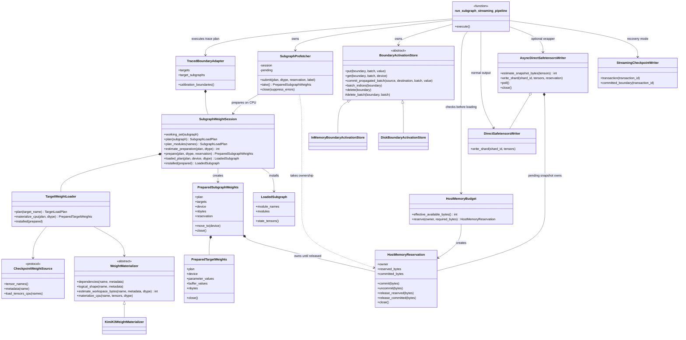
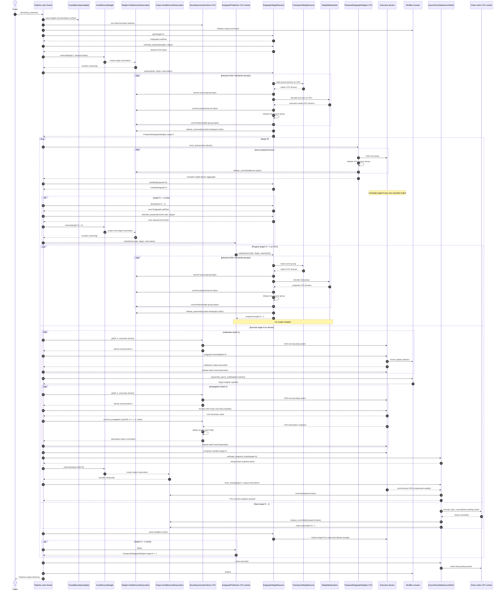

# Streaming PTQ

Streaming PTQ quantizes one sequential model target at a time. It preserves the
Modifier lifecycle and output format of `oneshot()` without requiring the full
uncompressed model to remain resident on the execution device.

This document defines the implemented architecture for the pretrained streaming
pipeline. The design has one execution device, one execution-ready CPU weight cache
for the next target, CPU-resident activation boundaries, and an optional bounded
asynchronous writer. The existing `pipeline_devices` API and model-specific
deferred-expert loading path have been removed.

## Design goals

The pretrained streaming path must satisfy these invariants:

1. Only the current sequential target is resident on the execution device.
2. All weights in the current target remain resident for its complete
   calibration, Modifier update, propagation, compression, and save lifecycle.
3. In normal mode, complete activation boundaries remain in CPU memory. Recovery
   mode may persist them on disk, but stages only one batch through CPU. The
   execution device never owns a complete boundary.
4. Each calibration and propagation forward transfers exactly one boundary
   batch from CPU to the execution device. The number of stored samples must not
   increase execution-device residency.
5. At most one next target is materialized in CPU memory.
6. Checkpoint decoding and casting finish before a prepared target enters the
   execution-device transfer boundary.
7. Model mutation and forward execution remain on the main thread.
8. Background workers own immutable prepared CPU tensors or independent output
   snapshots, never live model parameters.
9. Default execution does not write intermediate calibration artifacts.
10. `checkpoint_progress=True` is an explicit recovery mode, not the normal
   execution path.
11. A memory reservation failure is reported before another target is loaded;
   the pipeline does not silently fall back to per-module checkpoint reads.

The design deliberately separates four concerns:

| Concern | Owner | Device contract |
| --- | --- | --- |
| Checkpoint interpretation | `CheckpointWeightSource` and `WeightMaterializer` | Produces execution-ready CPU tensors |
| Target execution | `SubgraphWeightSession` and the streaming pipeline | Uses one explicit execution device |
| Activation boundaries | `BoundaryActivationStore` | Owns complete normal-mode boundaries on CPU and serves one batch at a time |
| Output persistence | Direct or recovery writer | Owns independent CPU snapshots |

## Class model

The following class diagram is the normative implementation contract.
Deferred-module classes and multi-device scheduling are intentionally absent.



`KimiK3WeightMaterializer` is shown as the representative model-specific
implementation. Cast and DeepSeek-V4 materializers implement the same CPU-only
`WeightMaterializer` contract.

The class contracts fix the following ownership decisions:

1. `SubgraphPrefetcher` always calls `prepare` for CPU. Its `submit` method has
   no device argument and owns at most one future.
2. The pipeline reserves host memory before `submit`. Ownership of that
   reservation moves to the prefetch task and then to
   `PreparedSubgraphWeights`; every failure path closes it.
3. `PreparedSubgraphWeights.move_to(device)` is the only pipeline-facing weight
   transfer method. It iterates through its `PreparedTargetWeights`, replaces one
   CPU tensor at a time in place, and releases the corresponding committed bytes
   after each successful copy. A partially moved object never escapes; any
   failure closes the complete aggregate after its tensors are released.
4. `SubgraphWeightSession.installed()` accepts only a completely prepared,
   single-device aggregate. Installation and restoration to meta remain on the
   main thread.
5. `BoundaryActivationStore.commit_propagated_batch()` snapshots the destination
   CPU batch before deleting the matching source batch. The pipeline does not
   call `delete_batch` directly.
6. `CheckpointWeightSource` and `WeightMaterializer` expose CPU-only load and
   materialization methods. The sole weight H2D boundary is
   `PreparedSubgraphWeights.move_to()`.
7. Before creating an output snapshot, the pipeline reserves its estimated CPU
   bytes. Ownership moves to the asynchronous writer and is released after the
   direct writer commits or fails. The writer never owns live model parameters
   or an activation boundary.
8. A reservation distinguishes unallocated `reserved_bytes` from allocated
   `committed_bytes`. Allocation commits bytes; freeing actual storage releases
   committed bytes; reusable workspace may be uncommitted back to its claim.
   State transitions and `close()` are thread-safe, and `close()` is idempotent
   because output reservations may be released by the writer thread.

## Execution lifecycle

For target N, the steady-state schedule is:

| Resource | Work |
| --- | --- |
| Execution device | Keep target N resident and execute one activation batch at a time |
| CPU boundary store | Retain boundary N and build boundary N + 1 batch by batch |
| CPU prefetch worker | Read and materialize target N + 1 |
| CPU writer worker | Optionally publish the independent snapshot of target N - 1 |

The target transition is ordered:

1. Finish all execution and snapshot ownership transfers for target N.
2. Restore target N to meta tensors and release its execution-device storage.
3. Wait for the prepared CPU state for target N + 1.
4. Move the prepared tensors to the execution device, releasing each CPU source
   tensor as ownership transfers.
5. Atomically install the complete prepared target into the meta model.
6. Start CPU materialization of target N + 2.
7. Execute target N + 1.

The first target is prepared synchronously because there is no preceding
computation to overlap. Every later target uses the same CPU prepare and device
transfer path; model-specific materializers do not bypass this lifecycle.

This is target-level prefetch, not pipeline parallelism. There is no second
execution device and no alternating model placement.

## System sequence

The normal-mode steady-state sequence below shows the three independent work
lanes with `async_save=True`. Target N executes on the single execution device
while target N + 1 is decoded into CPU memory and the already-owned snapshot of
target N - 1 may be written. Model mutation, Modifier callbacks, and forward
execution stay on the main thread. The prepare lane is absent for the final
target, and the writer lane is absent for the first target or when asynchronous
saving is disabled.



The execution lane intentionally performs two H2D passes over the same CPU
input boundary: calibration first, then post-Modifier propagation. The second
pass cannot reuse calibration outputs in the generic design because the Modifier
may have changed the resident weights.

Recovery mode preserves the same main-thread and execution-device sequence. It
substitutes `DiskBoundaryActivationStore` for the in-memory store and
`StreamingCheckpointWriter` transactions for the direct writers; the
asynchronous writer lane is disabled. Restored boundary batches still pass
through CPU one at a time.

## Relationship to `oneshot()`

The sequential `oneshot()` pipeline iterates calibration batches within each
subgraph and keeps onloaded parameters resident for the complete subgraph by
using `disable_offloading()`. Streaming PTQ must preserve that semantic boundary:
weights cannot be unloaded between calibration batches or before propagation.

The equivalent streaming order is:

```text
load target to execution device
  -> for each calibration batch: CPU-to-device, forward, release device batch
  -> sequential_epoch_end / Modifier update
  -> for each propagation batch: CPU-to-device, forward, snapshot next CPU batch
  -> compression
  -> compressed-weight snapshot to CPU
  -> unload target
```

This batch-major order is intentional. Expert-major execution is not required
when a complete MoE target fits on the execution device because every expert is
already resident. A future lower-memory execution strategy may use expert-major
scheduling, but it must be a separate, explicitly validated execution policy.

## Public API

The normal entry point accepts a local Transformers checkpoint, calibration
data, a standard recipe, one execution device, and output locations:

```python
from llmcompressor.streaming import streaming_oneshot

streaming_oneshot(
    model="/path/to/model",
    dataset=calibration_dataset,
    recipe=recipe,
    device="cuda:0",
    output_dir="/path/to/output",
    work_dir="/path/to/work",
    checkpoint_progress=False,
    async_save=True,
    pack_to_int8=True,
    finalize_only=False,
)
```

`pipeline_devices` is removed rather than deprecated. It described a bounded
two-GPU weight-prefetch implementation, not pipeline parallel execution, and it
would conflict with a future expert-placement API. Callers provide exactly one
`device` for target execution.

`async_save=True` remains independent of weight prefetch. It transfers completed
output tensors to independent CPU ownership synchronously, then performs
safetensors encoding and durable publication on one bounded background worker.
At most one output snapshot may be pending.

The advanced boundary-mode API remains available for adapters that provide an
explicit meta-model factory, target order, calibration boundaries, and exact
schemes. It follows the same single-device execution and CPU-prefetch contract.

`finalize_only=True` is a pretrained normal-mode recovery operation. It traces
the same target plan and rebuilds the same run identity, but does not initialize
modifiers or execute any target. It validates every completed shard under
`work_dir/publish` against that run identity, writes any still-missing static
model tensors, and then publishes the checkpoint.

## Tracing and boundaries

The pretrained entry point builds a meta model and traces ordered sequential
targets. Runtime prefix dependencies hidden behind autowrapped calls are
discovered from a real sample batch; model classes must not declare private,
model-specific prefix dependency lists.

A boundary contains the forward values needed by the next target, such as
hidden states, masks, positions, and model-specific residual state. It does not
contain weights, quantization parameters, or durable output data.

With `checkpoint_progress=False`, adjacent boundaries are held in CPU memory and
deduplicated where possible. With `checkpoint_progress=True`, completed target
transactions and their next boundaries are persisted for recovery; each disk
batch is loaded through CPU immediately before it is moved to the execution
device. Neither mode places a complete boundary on the execution device.

### Activation ownership and transfer

In normal mode, the boundary store owns the complete input dataset for target N
on CPU. A boundary is batch-oriented: one stored batch may contain several
tensors such as hidden states, masks, positions, and residual state, but all of
those tensors remain on CPU between forwards. Recovery mode applies the same
batch contract after loading one persisted batch through CPU.

Calibration and propagation are separate passes because a Modifier update may
change the target weights. Both passes fetch one complete boundary batch and
move that batch to the execution device immediately before `subgraph.forward`:

```text
calibration:
  fetch CPU boundary batch N[k]
  -> H2D one batch
  -> forward with hooks enabled
  -> discard forward output and release the device batch

propagation:
  fetch CPU boundary batch N[k]
  -> H2D one batch
  -> forward with hooks disabled
  -> snapshot boundary batch N+1[k] to CPU
  -> delete consumed CPU boundary batch N[k]
  -> release the device input and output
```

The propagation snapshot must complete successfully before its input batch is
deleted. This preserves exception safety and ensures that the two adjacent
boundaries roll forward rather than accumulating as two complete datasets. Once
the final input batch is consumed, boundary N has no remaining storage.

Cross-device `.to(device)` already creates independent storage. Boundary
transfer helpers must not add an unconditional `.clone()` after a cross-device
copy. A clone is required only when returning an isolated value on the same
device as the store. Aliasing and equal-tensor deduplication within the stored
CPU value must remain correct.

The current implementation uses synchronous, single-batch H2D. Optional H2D
overlap may be added later with one bounded pinned staging batch, a dedicated
copy stream, and an event that the execution stream waits on. It must be an
explicit execution option because it allows two activation batches to be live
on the execution device. Pinning the complete activation boundary is not
allowed.

Propagation runs after Modifier update with hooks and fake quantization disabled,
matching the existing Sequential Pipeline. This preserves algorithms that mutate
full-precision weights during their update. A model-specific shortcut may not
reuse calibration outputs unless its supported recipe contract proves that the
update cannot change propagated values.

## CPU prepared-target cache

The CPU cache owns one `PreparedSubgraphWeights` instance for the next target.
Prepared means:

- all source tensors and declared dependencies were read;
- checkpoint-specific decoding is complete;
- tensors have the selected floating computation dtype;
- shapes and source mappings were validated;
- tensors are contiguous and ready for execution-device transfer;
- the shared meta model has not been mutated.

The cache does not retain raw checkpoint groups in addition to decoded tensors.
Each raw group is released as soon as its final prepared tensor is produced.
Requests are sorted by source shard and physical `storage_index`, and shard
handles are reused for the complete preparation task.

Before either synchronous preparation or prefetch, the pipeline calls
`SubgraphWeightSession.estimate_preparation(plan, dtype)`. The estimate combines
logical output shapes, checkpoint dependency metadata, and each materializer's
declared workspace. The returned peak is reserved before any source tensor is
read.

The prefetch worker has depth one. It receives an immutable `SubgraphLoadPlan`
and calls `SubgraphWeightSession.prepare(plan, dtype, reservation)`. Preparation
is CPU-only by contract; neither the prefetcher nor the session accepts a
preparation device. The worker never installs parameters, invokes Modifier
callbacks, or runs model code.

`SubgraphPrefetcher` is a CPU-only prepared-target prefetcher. Its public
operations are:

```text
submit(plan, dtype, reservation, label) -> take ownership and start one task
take()                                  -> transfer prepared-state ownership
close()                                 -> drain or release the pending result
```

`submit` must not accept a device. `CheckpointWeightSource.load_tensors_cpu()`
and `WeightMaterializer.materialize_cpu()` make the CPU preparation boundary
explicit all the way down the call stack.

## CPU-to-device ownership transfer

`PreparedTargetWeights` is a CPU-prepared leaf owned by
`PreparedSubgraphWeights`, which is the aggregate ownership boundary. The
aggregate exposes the only pipeline-facing move operation and transfers all of
its target tensors without mutating the model:

```text
prepared_subgraph_cpu.move_to(execution_device)
```

The move mutates the aggregate in place. It must process one tensor at a time,
replace the CPU entry with the execution-device tensor, remove the corresponding
CPU reference immediately, and shrink its host-memory reservation. On failure
it closes the reservation and releases both moved and unconsumed tensors. Only a
completely moved, single-device aggregate may enter
`SubgraphWeightSession.installed()`.

When CPU is the execution device, `move_to("cpu")` is a no-op and the aggregate
retains its host-memory reservation until the installed context closes. This
keeps CPU-only execution under the same ownership accounting.

Installation remains atomic from the model's perspective: either every planned
parameter is installed and the target can execute, or the target remains meta.
Missing checkpoint state may allocate auxiliary tensors, but parameters with a
materialized source must never receive duplicate placeholder storage.

After parameters and persistent buffers are installed, their model registrations
become the sole owners of the materialized storage. The prepared-target maps must
drop their tensor references immediately. Otherwise replacing a BF16 parameter
during compression leaves the original storage alive until target unload, causing
the complete BF16 and compressed target to overlap on the execution device.

Pinned staging and asynchronous H2D may be added later, but a bounded pinned
buffer is required. Pinning an entire large MoE target is not acceptable.

## Materializer contract

A `WeightMaterializer` converts checkpoint-native tensors and dependencies into
the selected execution dtype. It must:

- declare all source dependencies before loading;
- expose the logical shape expected by the model;
- produce one independent floating CPU tensor;
- estimate any additional CPU workspace not represented by source or output
  tensor metadata before source reads begin;
- release raw dependency tensors after each materialized result;
- provide stable configuration data for artifact compatibility;
- avoid retaining global tensor or checkpoint-header caches.

The generic safetensors source uses the native safetensors loader for supported
dtypes and returns CPU tensors only. It must not manually parse safetensors
headers or data offsets. For a native `F8_E8M0` tensor, the source may expose its
storage bytes with `tensor.view(torch.uint8)` when a materializer requires UE8M0
exponent bits.

Format interpretation belongs to the materializer. Kimi K3 and DeepSeek-V4 use
the vLLM-compatible UE8M0 conversion:

```python
(scale_bytes.to(torch.int32) << 23).view(torch.float32)
```

This conversion is not equivalent to blindly casting every native E8M0 value to
FP32 at endpoint encodings. The conversion remains model-format logic; the
manual `_read_e8m0` file reader and its `lru_cache` do not.

## MoE targets

If one decoded MoE target fits on the execution device, all routed experts are
materialized and remain resident for the full target lifecycle. This is the
default policy and matches the residency behavior of sequential `oneshot()`.

For Kimi K3, the materializer reads each expert's `weight_packed` and
`weight_scale`, decodes it to BF16 in the CPU prefetch worker, and transfers the
complete decoder target to the execution device before calibration. It must not
install per-expert forward wrappers or load experts from the checkpoint during a
forward pass.

At sequence length 2048 with top-16 routing, nearly every one of Kimi K3's 896
experts can be active. Treating `moe_calibrate_all_experts=False` as a memory or
I/O optimization is therefore unsafe; it only changes the routing semantics for
experts with no selected tokens.

### Future expert parallelism

Expert parallelism is a future execution-placement feature, not a prefetch
feature. It will distribute one resident MoE target across a device group and
add token scatter, expert execution, output gather, and observer reduction.

No expert-parallel CLI is exposed until that execution path exists. The current
implementation preserves a clean boundary between prepared CPU state and target
placement so a future placement object can replace the single-device move. It
must not retain `pipeline_devices` as a placeholder for expert parallelism.

## Modifier lifecycle

Streaming PTQ reuses normal Modifier hooks and `sequential_epoch_end`; it does
not maintain separate implementations of iMatrix, RTN, GPTQ, SmoothQuant, AWQ,
SparseGPT, or Wanda.

A modifier is compatible only if every module it reads or changes is present in
the current working set. Cross-target mappings require an explicit working-set
declaration. GPTQ must retain its Hessian and perform error propagation while the
weight is resident; it cannot be reduced to precomputed qparams plus generic
RTN.

AutoRound remains unsupported because it owns both quantization and checkpoint
compression and therefore requires a dedicated streaming output adapter.

## Output and recovery

The normal path uses `checkpoint_progress=False`:

- activation boundaries remain in CPU memory and are consumed batch by batch;
- each target is written once as a final safetensors shard;
- immutable run metadata is replaced at startup because normal mode never resumes
  calibration state from `work_dir/artifacts`;
- finalization adds the index, config, recipe, and auxiliary files;
- `work_dir/publish` is renamed to `output_dir` on the same filesystem.

`checkpoint_progress=True` persists target transactions and boundary snapshots
for crash recovery. It has higher disk and I/O cost and must remain opt-in. CPU
next-target prefetch remains enabled because preparing immutable weights does not
change the durable transaction boundary. Asynchronous direct saving remains
disabled in recovery mode because recovery uses the transaction writer instead.

Recovery-mode manifests are strict resume records: a changed source, recipe,
dataset, target plan, or materializer is rejected. Normal-mode manifests are
replaceable publication metadata and are written before target execution. They
must not be regenerated after modifier finalization because modifier lifecycle
state is mutable and is not part of the immutable run identity.

If normal-mode quantization completed but final publication failed,
`finalize_only=True` preserves `work_dir/publish`, replaces stale normal-mode
metadata, verifies every target shard's stored run fingerprint, supplies static
tensors if the original run failed before that phase, and retries final
publication without requantizing. The caller must use the same model, dataset
fingerprint, recipe, target dtype, materializer, and packing option as the
completed run.

`pack_to_int8=True` packs W4A8 `int-quantized` weights before every writer path.
No unpacked INT4 checkpoint may be written as an intermediate normal-run output.

Do not load `work_dir/publish` while quantization is running. Only an output
directory containing `FINALIZED` is a published checkpoint.

## Memory model

Define:

| Symbol | Meaning |
| --- | --- |
| `T` | Largest decoded sequential target |
| `P` | Prepared CPU state for the next target |
| `C_in` | Unconsumed CPU input batches for the current target |
| `C_out` | Produced CPU output batches for the next target |
| `B` | Current execution-device activation batch, including forward outputs |
| `H` | Current execution-device Modifier statistics |
| `M_w` | Bounded CPU checkpoint-read and weight-materialization temporaries |
| `M_a` | One bounded CPU activation-copy temporary |
| `Q` | One independent compressed output snapshot |
| `R_d` | Execution framework, allocator, and device safety reserve |
| `R_h` | Host framework, allocator, and host safety reserve |

The steady-state lower bounds are:

```text
execution-device memory ~= T + B + H + runtime temporaries + R_d
host memory             ~= P + C_in + C_out + M_w + M_a + optional Q + R_h
```

The number of calibration batches changes `C_in` and `C_out`, not `B`. With
single-batch execution, increasing the sample count must not linearly increase
execution-device memory. During propagation, a successful output snapshot is
followed by deletion of the matching input batch, so `C_in` decreases as
`C_out` grows. For the brief commit window, the matching input and output
batches are both live; all other batches belong to exactly one adjacent
boundary.

If optional activation prefetch is implemented, the execution-device term
becomes approximately `T + 2 * B + H + runtime temporaries + R_d`. It must
never prefetch more than one batch.

Recovery mode replaces complete in-memory `C_in` and `C_out` with durable disk
boundaries and one CPU staging batch. It does not change the execution-device
bound because a complete boundary is never restored to the execution device.

During target transfer, CPU ownership is released tensor by tensor. The design
must not retain a complete CPU P after a complete device T exists.

Before submitting next-target prefetch, a host-memory reservation checks both
operating-system available memory and any active cgroup limit. That reservation
includes the next prepared target and its bounded materialization workspace.
Live activation batches and an asynchronous writer snapshot hold separate
reservations in the same shared budget. Each component therefore fails before
its corresponding allocation begins; insufficient capacity never disables
prefetch or switches to lazy checkpoint reads.

`HostMemoryBudget.effective_available_bytes()` uses the smaller of operating-
system available memory and cgroup remaining capacity, then subtracts `R_h` and
only the `reserved_bytes` of active reservations. It must not subtract
`committed_bytes`, because those allocations have already reduced the observed
OS and cgroup availability.

A reservation is accounting ownership, not an eager allocation. Weight
preparation initially claims `P + M_w`. Source groups and prepared outputs move
from reserved to committed accounting as they are allocated; released group
workspace is uncommitted for reuse by the next group. After decoding, the unused
workspace claim is released and the prepared aggregate retains committed `P`.
Its H2D move releases committed bytes tensor by tensor as CPU ownership ends.
The asynchronous writer separately claims `Q`, commits it during the synchronous
snapshot, and releases it after the pending write commits or fails. All
exceptions close the reservation held by the component that received ownership.

For GPTQ, add approximately `4 * in_features * in_features` bytes for each
active FP32 Hessian. iMatrix uses per-input-channel sums and counts and is much
smaller.

## Implementation map

| Area | Implemented responsibility |
| --- | --- |
| `streaming/pipeline.py` | Single-device scheduling, synchronous first-target preparation, depth-one CPU prefetch, batch-wise activation transfer, and bounded output ownership |
| `streaming/activations/store.py` | CPU boundary ownership, per-batch host reservations, and commit-before-consume propagation |
| `streaming/loading/host_memory.py` | OS/cgroup capacity checks and thread-safe reserved/committed accounting |
| `streaming/loading/prefetch.py` | One immutable CPU preparation task with explicit reservation ownership |
| `streaming/loading/session.py` | Preparation estimates, aggregate ownership, exception-safe `move_to()`, installation, and meta restoration |
| `streaming/loading/target.py` | Source-name planning, CPU-only target materialization, shape validation, and model installation |
| `streaming/materialization/` | CPU decoding, physical-order group reads, workspace estimates, and format-specific transforms |
| `streaming/checkpoint/weight_source.py` | Native CPU safetensors reads without manual header or offset parsing |
| `streaming/checkpoint/writer.py` | Direct output and one bounded asynchronous CPU snapshot with independent reservation ownership |

`async_save` is an output-I/O optimization and does not change target placement.
The removed multi-device and deferred-expert APIs have no compatibility aliases.
Production accelerator acceptance remains required for each new large-model
adapter even when the common CPU tests pass.

## Test and acceptance requirements

Fast tests must verify:

- a prepared CPU subgraph does not mutate the meta model;
- checkpoint sources and materializers return CPU tensors and cannot perform
  direct H2D;
- `PreparedSubgraphWeights.move_to()` is the only weight H2D boundary;
- aggregate transfer releases CPU tensors incrementally and a partial failure
  closes all moved and unconsumed storage;
- only one prefetch result can be pending;
- target N is unloaded before target N + 1 is installed;
- no target executes on a device other than the configured `device`;
- every complete in-memory boundary is CPU-resident;
- calibration and propagation transfer only one batch to the execution device;
- a failed propagated snapshot retains its input batch;
- a successful propagated snapshot deletes only its matching input batch;
- cross-device boundary transfer does not perform a redundant clone;
- increasing the calibration-batch count does not increase live
  execution-device boundary storage;
- source tensors are read once in physical storage order;
- raw materialization groups are released before the next group;
- a sourced parameter never receives duplicate placeholder storage;
- native U8 and `F8_E8M0` scale storage produce the expected UE8M0 bytes;
- writer and prefetch failures propagate and release owned storage;
- host-memory reservation failures occur before source reads;
- committed memory is not subtracted from OS availability a second time;
- reservation commit, uncommit, release, and close transitions reject
  underflow, are thread-safe, and close idempotently;
- prepared-state and writer ownership transfers release reservations on every
  success and failure path;
- checkpoint-progress recovery and normal final publication remain valid.

MoE tests must include a 896-expert, small-dimension fixture so expert count,
planning, naming, and target discovery match production cardinality without
requiring production memory. Kimi K3 remote-code tests must cover KDA and MLA
layers, attention-residual state, shared experts, multimodal prefix execution,
index-derived INT4 targets, W4 packing, and output reload.

Accelerator acceptance requires a production-shape MoE layer and then two
consecutive layers. Record:

- CPU prepared-target bytes and peak RSS;
- live `C_in`, `C_out`, and peak CPU boundary bytes;
- current and peak execution-device allocation;
- current and peak execution-device activation bytes;
- source read and materialization time;
- CPU-to-device transfer time;
- per-batch activation H2D and propagated-boundary D2H time;
- calibration, propagation, compression, and save time;
- finite iMatrix statistics and quantization scales;
- complete release of target N before target N + 1 execution;
- no complete activation boundary present on the execution device.

A tiny end-to-end pass is a functional check, not evidence that production
memory and scheduling behavior are correct.
